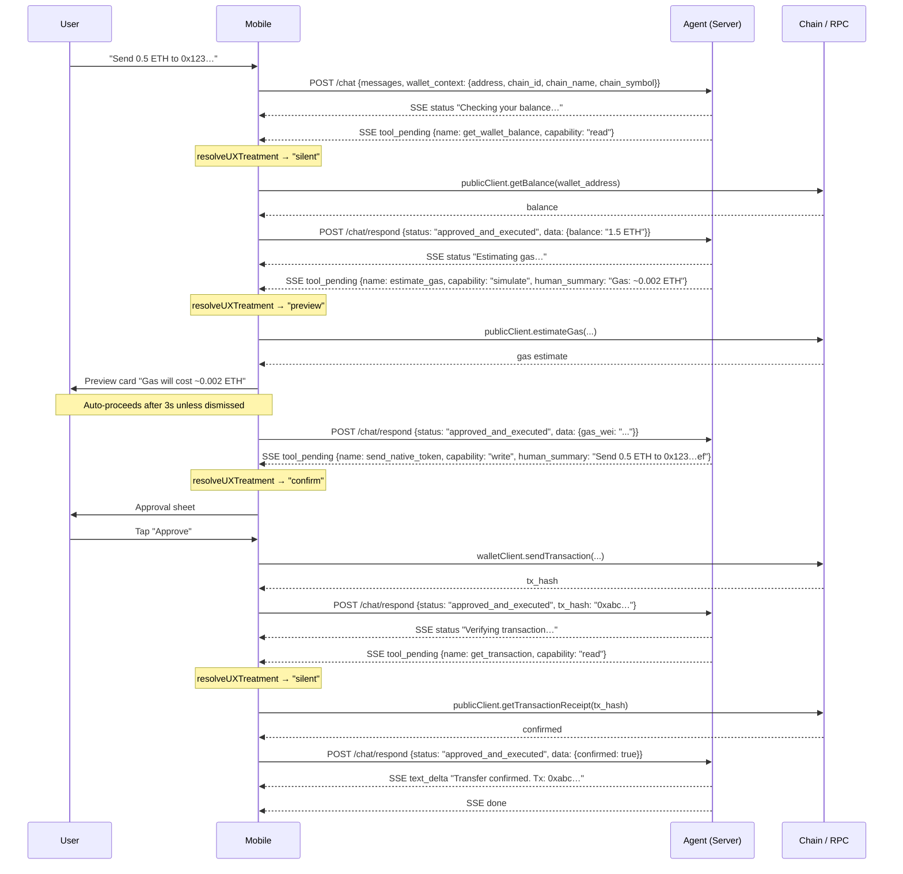

# Takumi Agent Protocol

> **Mobile Executes. Server Thinks. User Decides.**

This document is the contract between the Takumi Agent API and the mobile app for agentic, onchain-capable AI interactions. Both teams must implement to this spec exactly.

### The Claude Code Analogy

This is the same architecture Claude Code uses — and it's worth making the parallel explicit:

| Claude Code | Takumi Agent |
|---|---|
| Anthropic's servers run the LLM | Agent API runs the LLM |
| CLI on your laptop executes bash commands, edits files | Mobile executes transactions, signs, submits to chain |
| You approve/deny in the terminal | User approves/denies through the app UI |
| Claude Code's own permission model decides what to ask you | Mobile wallet's own `ApprovalPolicy` decides what to ask the user |

The key point: **Anthropic's servers don't run on your laptop. The LLM doesn't run on the device.** Likewise, the agent doesn't run on the phone — and the phone doesn't run the agent.

The server never tells the client "this action is dangerous, ask the user." The server just says what it wants to do. **The client decides whether to ask the human.** That decision belongs to whoever holds the keys — the mobile wallet.

---

## 1. The Four Actors

The original 3-entity model (User / Mobile / System) is correct but missing one:

| Actor | Role | Holds Keys? | Executes? |
|---|---|---|---|
| **User** | Intent + Approval | — | Approves/rejects sensitive actions |
| **Mobile** | UI + Transaction execution | Private key, biometrics | Signs and submits transactions |
| **Agent** (Server) | Reasoning + Planning | Never | Decides which tools to call |
| **Blockchain / RPC** | Source of truth | — | Finalizes state — final authority |

**Why Mobile and User are separate actors:**
Mobile auto-executes reads without interrupting the user. Only state-changing operations require an explicit user decision. The approval UI is a mobile concern — the server classifies what an action *does*, not how much friction the user should experience. That decision belongs to whoever holds the keys.

**Why Agent never holds keys:**
The server produces an *intent*. The mobile produces the *execution*. These are intentionally separated. The private key and seed phrase never leave the device — not even for simulation, not even as encrypted blobs. The agent only ever sees the public wallet address.

**Why Blockchain is a separate actor:**
The server can only confirm a transaction was *submitted*. The blockchain confirms it was *finalized*. Mobile must distinguish between `tx_submitted` and `tx_confirmed` states in the UI.

---

## 2. What the Agent Knows (and What It Must Never Know)

### Hard isolation boundary

The agent is a reasoning engine. It decides *what* to request. It has no access to *how* the mobile executes it.

| Information | Agent knows it? | Why |
|---|---|---|
| Wallet address (`0x…`) | **Yes** | Public — needed for reasoning ("your balance is…") |
| Supported chains + names | **Yes** | Declared by mobile at session start — agent reasons within these |
| Current active chain | **Yes** | Declared by mobile at session start |
| Available tool names + descriptions | **Yes** | Injected into LLM context as tool definitions |
| Tool results (balance, tx hash…) | **Yes** | Returned by mobile after execution |
| **Private key** | **Never** | Would allow server to sign without mobile or user |
| **Seed phrase / mnemonic** | **Never** | Would allow full wallet derivation server-side |
| **Wallet type** (hot / hardware / multisig) | **Never** | Internal mobile detail — agent doesn't need it |
| **Signing mechanism** | **Never** | How the mobile signs is opaque to the agent |
| **Other wallets or accounts** | **Never** | Agent only knows the address declared in the session |

The agent never asks for this information. If a user's message contains a private key or seed phrase, the mobile must strip it before forwarding to the server.

### How the agent knows which chains are available

Since all onchain actions execute on mobile, the agent cannot discover chains by querying a server-side registry. Instead, the mobile sends the **active chain** in every `POST /chat` request as part of `wallet_context`. The full chain list is intentionally omitted — it can be large, and the agent rarely needs it upfront.

The server injects the active chain into the agent's system prompt on every turn:

```
System context (auto-injected from wallet_context):

  Connected wallet: 0x742d…ef
  Active chain: Polygon (MATIC, chain_id: 137)

  All onchain actions are executed by the mobile app.
  You have no access to the private key or seed phrase.
  To get the full list of supported chains, call the get_supported_chains tool.
```

This means:
- Agent knows only the **active chain** at session start — name, chain_id, and native token symbol
- `supported_chains` is intentionally omitted from `WalletContext` — the list can be large and is rarely needed
- When the agent needs to enumerate all chains (e.g. "check my balance on all chains"), it calls `get_supported_chains` to get the full list
- If the user switches chains, mobile sends a new `POST /chat` with updated `wallet_context` (new `chain_id`, `chain_name`, `chain_symbol`)

---

## 3. Tool Execution Architecture

**The hard rule: all onchain actions execute on mobile. Non-onchain actions execute on server.**

The server has zero blockchain infrastructure — no RPC connections, no viem client, no chain registry. It is a pure reasoning engine + non-blockchain API gateway. Every interaction with the blockchain, whether reading a balance or submitting a transaction, goes through the mobile.

```
┌──────────────────────────────────────────────────────────────────┐
│                        AGENT (Server)                            │
│                                                                  │
│   ┌──────────────┐                                               │
│   │  LLM / Kimi  │ ── thinks ── decides which tools to call     │
│   └──────┬───────┘                                               │
│          │                                                        │
│    ┌─────┴──────────────────────────────────────┐                │
│    │              Tool Router                   │                │
│    └─────┬──────────────────────┬───────────────┘                │
│          │                      │                                 │
│   executor: "server"     executor: "mobile"                      │
│   (non-onchain only)     (ALL onchain — read or write)           │
│          │                      │                                 │
│   ┌──────▼──────────┐    ┌──────▼──────────┐                    │
│   │  Server MCP     │    │  SSE Stream     │                    │
│   │  Tool Layer     │    │  to Mobile      │                    │
│   │                 │    └─────────────────┘                    │
│   │ ┌─────────────┐ │                                            │
│   │ │TakumiPay API│ │                                            │
│   │ │(products,   │ │                                            │
│   │ │ bookings,   │ │                                            │
│   │ │ exchange    │ │                                            │
│   │ │ rates)      │ │                                            │
│   │ └─────────────┘ │                                            │
│   │ ┌─────────────┐ │                                            │
│   │ │External APIs│ │                                            │
│   │ │(future: DeFi│ │                                            │
│   │ │ data feeds, │ │                                            │
│   │ │ off-chain   │ │                                            │
│   │ │ services)   │ │                                            │
│   │ └─────────────┘ │                                            │
│   └─────────────────┘                                            │
└──────────────────────────────────────────────────────────────────┘
                               │ SSE (tool_pending)
                               ▼
┌──────────────────────────────────────────────────────────────────┐
│                          MOBILE                                  │
│                                                                  │
│   ┌──────────────┐     ┌──────────────────────────────────┐     │
│   │ SSE Handler  │────►│     Wallet Executor Layer        │     │
│   └──────────────┘     │                                  │     │
│                        │  ALL blockchain operations:      │     │
│   POST /chat/respond   │  reads (balance, contract state) │     │
│   ◄─────────────────── │  simulates (gas estimation)      │     │
│                        │  writes (transfer, sign, submit) │     │
│                        │                                  │     │
│                        │  ApprovalPolicy (per wallet)     │     │
│                        └──────────────────────────────────┘     │
│                                    │                             │
│                        ┌───────────▼──────────────┐             │
│                        │   RPC / Blockchain        │             │
│                        │   (viem, direct chain)    │             │
│                        └──────────────────────────┘             │
└──────────────────────────────────────────────────────────────────┘
```

### The Two Surfaces

**Surface 1: Server MCP Tool Layer — non-onchain only**

The agent calls these autonomously — no mobile involvement. The server connects to external non-blockchain APIs via MCP. Mobile sees `tool_executed` events as informational progress updates only.

```
Current server MCP tools:
  - TakumiPay API:   product catalog, search, variants, pricing
  - TakumiPay API:   bookings (create/reserve), exchange rates
  - TakumiPay API:   purchases, order history

Future server MCP tools (off-chain data only):
  - Off-chain price feeds:  fiat exchange rates, token USD prices
  - NFT metadata:           collection info, off-chain attributes
  - Identity / KYC:         off-chain address labels (e.g. "Andre")
```

> Note: Even if a future "DeFi" tool exists, if it touches the blockchain (calls a contract, submits a tx) it must move to mobile. Server MCP is for HTTP/REST APIs only.

**Surface 2: Mobile Execution Layer — all onchain**

Every tool that reads from or writes to a blockchain goes here, regardless of whether it needs user approval. Mobile has direct RPC access via viem. The `capability` field determines UX treatment — reads are silent, the user never notices them.

```
Onchain reads (silent, no user involvement):
  get_balance, read_contract, get_transaction,
  get_supported_chains, get_wallet_address, get_wallet_balance

Onchain simulations (preview, brief acknowledgement):
  estimate_gas

Onchain writes (confirm, user must approve):
  send_native_token, transfer_erc20, write_contract,
  approve_erc20, execute_booking, cancel_booking, create_purchase
```

### Why All Onchain on Mobile

- **No RPC on server** — the server has no viem client, no chain registry, no provider URLs. Simpler, smaller, no chain maintenance burden.
- **Consistency** — the mobile is always the source of truth for chain state. No risk of server reading a different block than the mobile just acted on.
- **Nonce safety** — the mobile manages its own nonce sequence. If server reads nonces independently, it risks conflicts with locally-tracked pending transactions.
- **Future-proof** — adding a new chain requires updating the mobile only, not deploying a server-side RPC config.

### Multi-Chain Targeting and Parallel Execution

Every mobile tool accepts a `chain_id` input parameter. When the agent wants to act on a specific chain, it sets `chain_id` in the tool call arguments — the mobile routes the RPC call to the correct viem client.

**Two ways the agent learns about available chains:**

| Mechanism | When | Purpose |
|---|---|---|
| `WalletContext.chain_id/chain_name` (injected) | Session start | Agent knows the active chain — acts on it without a tool call |
| `get_supported_chains` tool call | On demand | Agent fetches full chain list when it needs to enumerate or act across chains |

**When to call `get_supported_chains`:**

```
Call get_supported_chains when:
  - "Check my balance on all chains" — need the list to fan out parallel reads
  - "Which chain has the lowest gas right now?" — enumerate then call estimate_gas per chain
  - "Switch me to the cheapest chain" — enumerate to compare options
  - Any workflow that iterates over chains programmatically

Do NOT call get_supported_chains when:
  - Acting on the currently active chain (use wallet_context.chain_id directly)
  - The user names a specific chain — pass that chain_id, tool will fail naturally if unsupported
```

**Parallel reads across chains:**

For `capability: "read"` tools, the server may emit multiple `tool_pending` events concurrently. Mobile executes them in parallel and responds to each independently. This enables cross-chain aggregation in a single agent turn.

```
Agent turn: "What is my ETH balance on all my chains?"

Server emits (concurrently):
  tool_pending { name: "get_wallet_balance", input: { chain_id: 1    }, event_id: "t1" }
  tool_pending { name: "get_wallet_balance", input: { chain_id: 137  }, event_id: "t2" }
  tool_pending { name: "get_wallet_balance", input: { chain_id: 42161 }, event_id: "t3" }

Mobile executes all three in parallel, responds via POST /chat/respond:
  { tool_result: { event_id: "t1", status: "approved_and_executed", data: { balance: "1.2 ETH" } } }
  { tool_result: { event_id: "t2", status: "approved_and_executed", data: { balance: "0.0 MATIC" } } }
  { tool_result: { event_id: "t3", status: "approved_and_executed", data: { balance: "0.4 ETH" } } }

Server aggregates results → agent composes final response
```

> **Constraint**: Parallel emission is only permitted for `capability: "read"` tools. `simulate` and `write` tools are always sequential — the agent must wait for one to complete before emitting the next.

**Chain switching mid-conversation:**

The agent does NOT call a "switch_chain" tool. Chain switching is a wallet UX concern:

1. User says "switch to Polygon"
2. Mobile switches its active chain
3. Mobile sends a new `POST /chat` with updated `wallet_context.chain_id: 137`
4. Agent sees the new context in the next turn

For cross-chain operations (acting on two chains in one turn), the agent passes `chain_id` explicitly in each tool call rather than switching the wallet's active chain.

---

### Adding a New Server-Side Tool (non-onchain)

1. Connect API via MCP in `mcp-client.service.ts`
2. Add tool to `TOOL_REGISTRY` with `executor: "server"`
3. No mobile changes required

### Adding a New Onchain Tool

1. Add to `TOOL_REGISTRY` with `executor: "mobile"` and appropriate `capability`
2. Add `buildHumanSummary()` case (required for `simulate` and `write` capability)
3. Mobile adds executor function to its executor registry
4. If `capability: "write"`, add `tool_overrides` entry in `ApprovalPolicy` if special handling needed

---

## 4. Transport (Server ↔ Mobile)

### Why not stdio MCP on mobile

Current server-side flow: `ChatService → spawns subprocess → MCP server (stdio)`. Mobile has no process spawning, no file descriptors, no shared memory. The transport must be HTTP-based.

### Why SSE + HTTP (not WebSocket)

| Concern | SSE + HTTP | WebSocket |
|---|---|---|
| Infrastructure | Standard HTTP/2, works through proxies/CDNs | Requires WS upgrade, some proxies block |
| Reconnect | Built-in `Last-Event-ID` resume | Manual reconnect logic |
| Mobile → Server | Standard `POST /chat/respond` | WS message back on same socket |
| Complexity | Low | Medium |
| Streaming text | Native | Works but overkill |

**Decision: SSE for server→mobile, HTTP POST for mobile→server.**

```
Mobile → Server:  POST /chat             Start or continue a conversation turn
Mobile → Server:  POST /chat/respond     Return a tool result or rejection
Server → Mobile:  SSE stream             Text chunks + tool call events
```

The SSE stream stays open for the duration of one agent reasoning turn, then closes. Mobile reconnects on the next user message.

### SSE Reconnect Mid-Turn

If the SSE connection drops while the session is `AWAITING_MOBILE_RESULT` (agent has emitted `tool_pending` but hasn't received `POST /chat/respond`), the mobile loses the event. The mobile must reconnect and the server must re-deliver it.

**Protocol:**

Mobile reconnects by re-sending `POST /chat` with the existing `session_id` and an empty `messages` array (no new user message — just reconnecting):

```typescript
// Mobile reconnect after SSE drop
await fetch("/chat", {
  method: "POST",
  body: JSON.stringify({
    session_id: existingSessionId,
    messages:   [],              // empty = reconnect only, no new input
    wallet_address: wallet.address,
  }),
});
```

Server behaviour on reconnect:

```typescript
// In POST /chat handler
if (request.session_id && request.messages.length === 0) {
  const session = sessionStore.get(request.session_id);

  if (!session) {
    // Session expired during disconnect
    yield { event: "error", data: { code: "session_expired", message: "Session expired. Please start a new conversation.", retryable: false } };
    return;
  }

  if (session.state === "awaiting_mobile") {
    // Re-emit all unresolved tool_pending events
    for (const [toolCallId, deferred] of session.pending) {
      yield { event: "tool_pending", data: session.pendingPayloads.get(toolCallId) };
    }
    return; // SSE stays open, loop resumes when mobile responds
  }

  if (session.state === "streaming") {
    // Agent is mid-reasoning — mobile just waits, stream will resume
    return;
  }
}
```

This requires the session to store the original `ToolPendingPayload` alongside the deferred promise, so it can be re-emitted on reconnect.

---

## 5. Tool Classification (Central Registry)

**This is the most critical design decision.** Centralize all tool metadata in one server-side file. Both the agent loop and the mobile SDK derive behavior from this registry.

### The Two Classification Axes

| Axis | Owned by | Values | Meaning |
|---|---|---|---|
| `executor` | Server | `"server"` / `"mobile"` | Who actually runs the tool |
| `capability` | Server | `"read"` / `"simulate"` / `"write"` | What the action *does* — factual, not UX |

**`capability` is not `sensitivity`.** Following the Claude Code analogy: the server says what it wants to do, the mobile decides how to handle it. The server does not know what wallet is connected, what the user's risk tolerance is, or whether a hardware device will add its own physical confirmation. The UX treatment (`silent` / `preview` / `confirm` / `blocked`) is determined by the mobile wallet's `ApprovalPolicy` — not by the server.

`capability` exists on the server for one reason the Claude Code analogy doesn't need: **when a new tool is added server-side, the mobile must handle it safely without a forced app update.** The mobile's fallback rule is: `capability: "write"` from an unknown tool → treat as `confirm`. Without `capability`, the mobile has no safe default for tools it hasn't seen before.

### Capability Definitions

| Capability | Meaning | Reversible? | Examples |
|---|---|---|---|
| `read` | Queries state, no side effects | N/A | get_balance, read_contract, get_transaction |
| `simulate` | Computes or reserves without finalizing on-chain | Yes | estimate_gas, create_booking (server-side reservation) |
| `write` | Mutates on-chain state or triggers irreversible payment | **No** | send_native_token, execute_booking, write_contract |

### Full Tool Classification Table

**Executor rule: onchain = mobile, non-onchain = server. No exceptions.**

| Tool | Category | Executor | Capability | Notes |
|---|---|---|---|---|
| `get_balance` | blockchain_read | **mobile** | read | Silent — no user involvement |
| `read_contract` | blockchain_read | **mobile** | read | Silent |
| `get_transaction` | blockchain_read | **mobile** | read | Silent |
| `get_wallet_address` | blockchain_read | **mobile** | read | Silent |
| `get_wallet_balance` | blockchain_read | **mobile** | read | Silent |
| `get_supported_chains` | blockchain_read | **mobile** | read | Silent — active chain enumeration for parallel/cross-chain ops |
| `estimate_gas` | blockchain_read | **mobile** | simulate | Preview — user sees cost before write |
| `send_native_token` | blockchain_write | **mobile** | write | Confirm required |
| `transfer_erc20` | blockchain_write | **mobile** | write | Confirm required |
| `write_contract` | blockchain_write | **mobile** | write | Confirm required |
| `approve_erc20` | blockchain_write | **mobile** | write | Confirm + special warning |
| `get_products` | takumipay | server | read | TakumiPay HTTP API |
| `search_products` | takumipay | server | read | TakumiPay HTTP API |
| `get_product_prices` | takumipay | server | read | TakumiPay HTTP API |
| `get_latest_exchange_rate` | takumipay | server | read | TakumiPay HTTP API |
| `create_booking` | takumipay | server | simulate | Reserves slot server-side |
| `execute_booking` | takumipay | **mobile** | write | Triggers onchain payment |
| `cancel_booking` | takumipay | **mobile** | write | Triggers onchain refund/cancel |
| `create_purchase` | takumipay | **mobile** | write | Triggers onchain payment |

### TypeScript Shape (Server)

```typescript
// src/tools/registry.ts

export type ToolExecutor   = "server" | "mobile";
export type ToolCapability = "read" | "simulate" | "write";
export type ToolCategory   = "blockchain_read" | "blockchain_write" | "takumipay" | "utility";

export interface ToolMeta {
  name:       string;
  category:   ToolCategory;
  executor:   ToolExecutor;
  capability: ToolCapability;
  description: string;
}

export const TOOL_REGISTRY: Record<string, ToolMeta> = {
  // ── Onchain reads — executor: mobile, silent execution ──────────
  get_balance: {
    name:        "get_balance",
    category:    "blockchain_read",
    executor:    "mobile",
    capability:  "read",
    description: "Query native token balance for any address on any chain",
  },
  get_wallet_balance: {
    name:        "get_wallet_balance",
    category:    "blockchain_read",
    executor:    "mobile",
    capability:  "read",
    description: "Query the connected wallet's native token balance",
  },
  read_contract: {
    name:        "read_contract",
    category:    "blockchain_read",
    executor:    "mobile",
    capability:  "read",
    description: "Call a read-only function on any smart contract",
  },
  get_transaction: {
    name:        "get_transaction",
    category:    "blockchain_read",
    executor:    "mobile",
    capability:  "read",
    description: "Retrieve transaction details and confirmation status by hash",
  },
  get_wallet_address: {
    name:        "get_wallet_address",
    category:    "blockchain_read",
    executor:    "mobile",
    capability:  "read",
    description: "Return the connected wallet's address",
  },
  get_supported_chains: {
    name:        "get_supported_chains",
    category:    "blockchain_read",
    executor:    "mobile",
    capability:  "read",
    description: "Return the full list of chains the connected wallet supports — use this for dynamic chain enumeration and parallel cross-chain operations",
  },

  // ── Onchain simulation — executor: mobile, preview UX ───────────
  estimate_gas: {
    name:        "estimate_gas",
    category:    "blockchain_read",
    executor:    "mobile",
    capability:  "simulate",
    description: "Estimate gas cost for a transaction — always call before write tools",
  },

  // ── Onchain writes — executor: mobile, confirm required ─────────
  send_native_token: {
    name:        "send_native_token",
    category:    "blockchain_write",
    executor:    "mobile",
    capability:  "write",
    description: "Transfer native gas tokens (ETH, MATIC, BNB) — NOT for ERC20 tokens",
  },
  transfer_erc20: {
    name:        "transfer_erc20",
    category:    "blockchain_write",
    executor:    "mobile",
    capability:  "write",
    description: "Transfer ERC20 tokens (USDT, USDC, DAI, etc.) from the connected wallet",
  },
  write_contract: {
    name:        "write_contract",
    category:    "blockchain_write",
    executor:    "mobile",
    capability:  "write",
    description: "Call a state-changing function on any smart contract",
  },
  approve_erc20: {
    name:        "approve_erc20",
    category:    "blockchain_write",
    executor:    "mobile",
    capability:  "write",
    description: "Grant a contract permission to spend ERC20 tokens on behalf of the user",
  },

  // ── TakumiPay reads — executor: server (HTTP API, not onchain) ──
  get_products: {
    name:        "get_products",
    category:    "takumipay",
    executor:    "server",
    capability:  "read",
    description: "Fetch TakumiPay product catalog",
  },
  search_products: {
    name:        "search_products",
    category:    "takumipay",
    executor:    "server",
    capability:  "read",
    description: "Search TakumiPay products by keyword or category",
  },
  get_product_prices: {
    name:        "get_product_prices",
    category:    "takumipay",
    executor:    "server",
    capability:  "read",
    description: "Get pricing for a TakumiPay product",
  },
  get_latest_exchange_rate: {
    name:        "get_latest_exchange_rate",
    category:    "takumipay",
    executor:    "server",
    capability:  "read",
    description: "Fetch current fiat/token exchange rates from TakumiPay",
  },

  // ── TakumiPay simulation — executor: server ──────────────────────
  create_booking: {
    name:        "create_booking",
    category:    "takumipay",
    executor:    "server",
    capability:  "simulate",
    description: "Reserve a TakumiPay booking (no payment yet) — preview before execute_booking",
  },

  // ── TakumiPay writes — executor: mobile (triggers onchain payment)
  execute_booking: {
    name:        "execute_booking",
    category:    "takumipay",
    executor:    "mobile",
    capability:  "write",
    description: "Execute a TakumiPay booking — triggers irreversible onchain payment",
  },
  cancel_booking: {
    name:        "cancel_booking",
    category:    "takumipay",
    executor:    "mobile",
    capability:  "write",
    description: "Cancel a booking — may trigger onchain refund",
  },
  create_purchase: {
    name:        "create_purchase",
    category:    "takumipay",
    executor:    "mobile",
    capability:  "write",
    description: "Create a direct purchase — triggers onchain payment",
  },
};
```

### Mobile-Side: Wallet Approval Policy

The mobile maintains an `ApprovalPolicy` per connected wallet. It maps `capability` → UX treatment. The server never dictates this mapping — only the wallet knows its own security model.

```typescript
// Mobile wallet SDK

export type UXTreatment = "silent" | "preview" | "confirm" | "blocked";

export interface ApprovalPolicy {
  read:     UXTreatment;
  simulate: UXTreatment;
  write:    UXTreatment;
  // Optional overrides per tool name (e.g. extra warning for approve_erc20)
  tool_overrides?: Record<string, UXTreatment>;
  // Optional amount threshold: writes below this USD value get "preview" instead of "confirm"
  auto_approve_below_usd?: number;
}
```

**Built-in policies by wallet type:**

```typescript
// Hot wallet (in-app, key in secure enclave)
const HOT_WALLET_POLICY: ApprovalPolicy = {
  read:     "silent",
  simulate: "preview",   // show gas/booking preview — auto-proceed after 3s
  write:    "confirm",   // hard stop, explicit tap required
  tool_overrides: {
    approve_erc20: "confirm",  // always hard confirm, never preview
  },
};

// Hardware wallet (Ledger / Trezor)
// Device will physically prompt regardless — but mobile still shows context UI
const HARDWARE_WALLET_POLICY: ApprovalPolicy = {
  read:     "silent",
  simulate: "preview",
  write:    "confirm",   // mobile shows context + waits for device confirmation
};

// Watch-only (no private key on device)
const WATCH_ONLY_POLICY: ApprovalPolicy = {
  read:     "silent",
  simulate: "silent",
  write:    "blocked",   // cannot execute — mobile immediately rejects write tools
};

// Multisig wallet
const MULTISIG_POLICY: ApprovalPolicy = {
  read:     "silent",
  simulate: "preview",
  write:    "confirm",   // shows required signers, queues proposal
};
```

**Resolving UX treatment at runtime:**

```typescript
function resolveUXTreatment(
  capability: ToolCapability,
  toolName:   string,
  policy:     ApprovalPolicy,
  inputAmountUsd?: number,
): UXTreatment {
  // Tool-level override takes priority
  if (policy.tool_overrides?.[toolName]) {
    return policy.tool_overrides[toolName];
  }

  const base = policy[capability];

  // Amount threshold: downgrade "confirm" → "preview" for small writes
  if (
    base === "confirm" &&
    policy.auto_approve_below_usd !== undefined &&
    inputAmountUsd !== undefined &&
    inputAmountUsd < policy.auto_approve_below_usd
  ) {
    return "preview";
  }

  return base;
}
```

The `UXTreatment` values map to mobile UI behavior:

| Treatment | Behavior |
|---|---|
| `silent` | Execute immediately, show a brief status label |
| `preview` | Show summary card — auto-proceeds after 3 seconds unless dismissed |
| `confirm` | Hard stop — explicit user tap required, no timeout |
| `blocked` | Immediately reject — send `tool_rejected` back to server |

---

## 6. Permission Grants & Trust Delegation

The `ApprovalPolicy` defines what a wallet type does by default. **Permission Grants** let the user override that — delegating varying degrees of autonomy to the agent for actions that would normally require approval.

This is entirely a mobile-side concern. The server never knows about grants. It sends `capability: "write"` regardless — the mobile checks active grants and decides whether to silently execute or show the user.

### Grant Lifetime Options

```
┌────────────────────────────────────────────────────────────────┐
│               Trust Delegation Spectrum                        │
│                                                                │
│  STRICTEST                                          BROADEST  │
│  ◄──────────────────────────────────────────────────────────► │
│                                                                │
│  always_ask   once   session   timed    permanent             │
│      │          │       │         │          │                │
│  every call  just   until    until       until               │
│  prompts     this   session  date/       explicitly          │
│              one    ends     time        revoked             │
└────────────────────────────────────────────────────────────────┘
```

| Lifetime | When it expires | Use case |
|---|---|---|
| `always_ask` | Never | Maximum control — every action confirmed |
| `once` | After this single invocation | Default fallback — no grant stored |
| `session` | When the SSE session closes | "I'm actively watching, just do it" |
| `timed` | At a specific Unix timestamp | "I'm trading for the next hour" |
| `permanent` | Never — until explicitly revoked | Power user / settings-level default |

### Grant Data Model

```typescript
// Mobile-side only — server never sees this

type GrantLifetime =
  | { type: "always_ask" }              // overrides everything — always prompt
  | { type: "once" }                    // no grant stored, just execute this time
  | { type: "session"; session_id: string }
  | { type: "timed";   expires_at: number }   // Unix ms timestamp
  | { type: "permanent" }

type GrantScope =
  | { kind: "tool";       key: string }        // e.g. "send_native_token"
  | { kind: "capability"; key: ToolCapability }// e.g. "write"
  | { kind: "global" }                         // all tools

interface PermissionGrant {
  scope:          GrantScope;
  lifetime:       GrantLifetime;
  wallet_address: `0x${string}`;
  granted_at:     number;  // Unix ms
}
```

Grants are stored locally on device (e.g. secure AsyncStorage). They are wallet-scoped — a grant for wallet A does not apply to wallet B.

### Grant Resolution

When a `tool_pending` arrives, the mobile resolves the effective grant in priority order:

```typescript
function resolveGrant(
  toolName:   string,
  capability: ToolCapability,
  wallet:     `0x${string}`,
  sessionId:  string,
  store:      PermissionGrantStore,
): GrantLifetime {
  const now = Date.now();

  // Priority: tool-specific > capability-level > global
  const candidates = [
    store.find({ kind: "tool",       key: toolName,    wallet }),
    store.find({ kind: "capability", key: capability,  wallet }),
    store.find({ kind: "global",                       wallet }),
  ];

  for (const grant of candidates) {
    if (!grant) continue;

    // Check if this grant is still active
    switch (grant.lifetime.type) {
      case "always_ask": return { type: "always_ask" };   // hard override
      case "permanent":  return grant.lifetime;
      case "session":
        if (grant.lifetime.session_id === sessionId) return grant.lifetime;
        break;
      case "timed":
        if (grant.lifetime.expires_at > now) return grant.lifetime;
        else store.remove(grant);  // clean up expired grant
        break;
    }
  }

  // No active grant — fall back to "once" (use wallet ApprovalPolicy)
  return { type: "once" };
}
```

### Combining Grant + ApprovalPolicy → UX Treatment

```typescript
function resolveUXTreatment(
  capability:    ToolCapability,
  toolName:      string,
  wallet:        ConnectedWallet,
  sessionId:     string,
  amountUsd?:    number,
): UXTreatment {
  const grant = resolveGrant(toolName, capability, wallet.address, sessionId, wallet.grantStore);

  switch (grant.type) {
    case "always_ask":
      // User explicitly locked this — ignore everything else
      return "confirm";

    case "permanent":
    case "session":
    case "timed":
      // Active grant — execute silently
      return "silent";

    case "once":
      // No grant — fall through to base wallet policy
      return wallet.approvalPolicy.resolve(capability, toolName, amountUsd);
  }
}
```

### The Approval Sheet with Grant Selection

When `resolveUXTreatment` returns `"confirm"`, the mobile shows an approval sheet that includes grant duration options. The user's choice both approves the action AND stores a grant for future invocations.

```
┌─────────────────────────────────────────────┐
│  Send 0.5 ETH                               │
│  to 0x123…ef on Polygon                     │
│                                             │
│  Allow agent to do this:                   │
│  ○ Just this once                           │
│  ○ For this session                         │
│  ● For the next  [ 1 hour ▾ ]              │
│  ○ Until  [ pick a date ]                  │
│  ○ Always (manage in Settings)             │
│                                             │
│         [Reject]    [Approve]               │
└─────────────────────────────────────────────┘
```

```typescript
async function handleApproval(payload: ToolPendingPayload, session: AgentSession) {
  const choice = await showApprovalSheet({
    title:         toolDisplayName(payload.name),
    summary:       payload.meta.human_summary,
    warning:       specialWarning(payload.name),
    grantOptions:  buildGrantOptions(session.session_id),  // the radio buttons
  });

  if (!choice.approved) {
    await rejectTool(payload, session, "user_declined");
    return;
  }

  // Store grant if user chose anything beyond "once"
  if (choice.lifetime.type !== "once") {
    wallet.grantStore.add({
      scope:          choice.scope,   // which tool or capability user selected
      lifetime:       choice.lifetime,
      wallet_address: wallet.address,
      granted_at:     Date.now(),
    });
  }

  await executeTool(payload, session);
}
```

### App Settings: Managing Active Grants

The settings screen lets users view and revoke grants without waiting for an approval prompt.

```
Active Agent Permissions
────────────────────────────────────────────────────────
send_native_token     "1 hour"      expires 3:45 PM    [Revoke]
blockchain_write      "Session"     session #a1b2      [Revoke]
All actions           "Always"      granted Jan 10     [Revoke]
────────────────────────────────────────────────────────
Default mode:  ○ Always ask   ● Agent decides*  ○ Full auto

* Agent uses wallet policy — asks for writes, previews simulates
```

### Default Permission Mode

This is a **product decision** — two valid defaults exist:

| Mode | Description | Good for |
|---|---|---|
| **Conservative** (default deny) | No grants. Agent always prompts for writes. User explicitly unlocks. | New users, high-value wallets |
| **Autonomous** (default allow) | Global permanent grant active by default. User restricts in settings. | Power users, trading sessions |

The protocol supports both. The difference is whether `wallet.grantStore` starts empty or with a pre-installed global permanent grant.

```typescript
// Conservative default — start empty
const conservativeStore = new PermissionGrantStore([]);

// Autonomous default — pre-install a global grant
const autonomousStore = new PermissionGrantStore([{
  scope:          { kind: "global" },
  lifetime:       { type: "permanent" },
  wallet_address: wallet.address,
  granted_at:     Date.now(),
}]);
```

Regardless of mode, `always_ask` grants always override — the user can lock down a specific tool even in autonomous mode.

---

## 7. Agent Behavioral Constraints

These are non-negotiable rules encoded in the agent system prompt. They define how the agent must reason, not just what tools it can call.

```
## Agent Rules

### Objectives
- Help users manage crypto assets and TakumiPay purchases safely
- Never execute irreversible actions without user approval

### Chain awareness
- Your context shows only the **active chain** — use it for single-chain actions without any tool call
- To act on a different chain, call `get_supported_chains` first to verify the chain_id is available
- If a tool call fails due to an unsupported chain_id, tell the user that chain is not supported by their wallet
- NEVER invent or assume a chain_id — only use chain_ids from the active chain context or from `get_supported_chains`

### Pre-conditions (must verify before acting)
- ALWAYS call get_wallet_balance before any token transfer tool call
- ALWAYS call estimate_gas before any blockchain_write tool call
- ALWAYS call create_booking before execute_booking
- NEVER assume wallet state — always read it fresh via tool calls

### Privacy
- You have access to the wallet address (public). You do NOT have access to the private key or seed phrase.
- If a user message appears to contain a private key or seed phrase, do NOT process or repeat it. Tell the user to never share these with anyone.

### Decision-making
- Prefer the fewest tool calls to accomplish the goal
- If the user's intent is ambiguous, ask for clarification before calling any tool
- If a tool fails, diagnose why before retrying — do not retry blindly
- If the user rejects an action, acknowledge it and offer alternatives

### Honesty
- Never hallucinate transaction hashes, balances, or prices
- Report tool errors to the user verbatim — do not soften or hide them
- If a tool is unavailable, say so explicitly
```

### System Prompt: Wallet Context Injection

When the server receives `POST /chat`, it builds the wallet context block and prepends it to the system prompt before every turn:

```typescript
function buildWalletContextPrompt(ctx: WalletContext): string {
  return `
## Connected Wallet
Address: ${ctx.address}${ctx.label ? ` (${ctx.label})` : ""}
Active chain: ${ctx.chain_name} (${ctx.chain_symbol}, chain_id: ${ctx.chain_id})

All onchain actions are executed by the mobile app.
You have no access to the private key or seed phrase — never ask for them.
To get the full list of supported chains, call the get_supported_chains tool.
`.trim();
}
```

This is injected as a `system` message, not as a user message, so it doesn't appear in the chat UI.

### Enforced Sequence for Writes

The agent must always follow this sequence for any token transfer. All steps are mobile round-trips — the server has no blockchain access.

```
1. get_wallet_balance   → mobile reads silently, returns balance to agent
2. estimate_gas         → mobile reads, resolves to "preview" — user sees cost
3. send_native_token    → mobile resolves to "confirm" — user approves
4. [tx_hash returned]   → mobile submits to chain, returns hash
5. get_transaction      → mobile reads silently, confirms finality
```

Steps 1 and 5 are `capability: "read"` — the user never sees them. Step 2 is `capability: "simulate"` — the user sees a brief preview. Step 3 is `capability: "write"` — the user explicitly approves.

This is enforced by system prompt instruction, not by code. If the agent skips steps 1 or 2, the mobile still executes step 3 — the sequence prevents the agent from hallucinating "you have enough funds".

---

## 8. The Message Protocol

### 8.1 Full Interaction Flow



### 8.2 Mobile → Server: Start a turn

```
POST /chat
Content-Type: application/json
x-api-key: <CHAT_API_KEY>
```

```typescript
interface ChatRequest {
  session_id?:    string;          // omit to start a new session
  messages:       UIMessage[];
  wallet_context: WalletContext;   // replaces bare wallet_address + chain_id
}

interface WalletContext {
  address:      `0x${string}`;  // public address only — never private key or seed
  chain_id:     number;         // currently active chain (e.g. 137 for Polygon)
  chain_name:   string;         // human-readable name of active chain, e.g. "Polygon"
  chain_symbol: string;         // native token symbol, e.g. "MATIC"
  label?:       string;         // optional user-defined wallet name, e.g. "My Ledger"
  // supported_chains intentionally omitted — call get_supported_chains tool if needed
}

// Returned by the get_supported_chains tool (not part of WalletContext)
interface ChainInfo {
  chain_id: number;
  name:     string;  // "Polygon", "Ethereum", "BNB Chain"
  symbol:   string;  // "MATIC", "ETH", "BNB"
  testnet?: boolean;
}
```

**Why `supported_chains` is declared here and not discovered via tool:**
The agent must know what chains it can work with before it generates its first response. Declaring chains in the request lets the server inject them into the system prompt immediately. The agent can then reject unsupported chain requests without any round-trip. If the user switches chains, mobile sends a new `POST /chat` with updated `wallet_context.chain_id`.

**What the server must never store or log from this request:**
Only `wallet_context.address`, `chain_id`, and `supported_chains` are needed for agent reasoning. The server must never request, store, or forward `private_key`, `seed_phrase`, or any signing material. If a user accidentally pastes a seed phrase in a message, the mobile must strip it before sending.

Server responds with `Content-Type: text/event-stream`. The SSE connection stays open for the duration of the agent turn and closes on `done` or `error`.

### 8.3 Server → Mobile: SSE Events

Every SSE line is a JSON-encoded event in this shape:

```typescript
type AgentEvent =
  | { event: "text_delta";    data: TextDeltaPayload    }
  | { event: "status";        data: StatusPayload        }  // lightweight progress
  | { event: "tool_pending";  data: ToolPendingPayload  }  // mobile MUST respond
  | { event: "tool_executed"; data: ToolExecutedPayload }  // server-side, informational
  | { event: "done";          data: DonePayload          }
  | { event: "error";         data: ErrorPayload         };
```

#### `text_delta` — streaming text chunk

```typescript
interface TextDeltaPayload {
  content: string;
}
```

#### `status` — lightweight progress indicator

Shown in the chat as a transient label (e.g. "Checking balance…"). Does not require a response.

```typescript
interface StatusPayload {
  message: string;  // e.g. "Checking balance...", "Estimating gas..."
}
```

#### `tool_pending` — mobile must execute and respond

Emitted for every tool with `executor: "mobile"`. The server declares *what* the action does (`capability`). The mobile wallet decides *how much friction* to apply based on its `ApprovalPolicy`.

```typescript
interface ToolPendingPayload {
  session_id:   string;
  tool_call_id: string;                // stable ID to correlate POST /chat/respond
  name:         string;
  input:        Record<string, unknown>;
  meta: {
    executor:       "mobile";
    capability:     ToolCapability;    // "read" | "simulate" | "write" — factual, not UX
    category:       ToolCategory;
    human_summary:  string;           // server-built, human-readable action description
    amount_usd?:    number;           // if applicable — mobile uses for threshold checks
    // e.g. "Send 0.5 ETH to 0x123…ef on Polygon"
    // e.g. "Gas estimate: ~0.002 ETH ($3.20)"
    // e.g. "Pay Rp 50.000 for Telkomsel 50K top-up (booking #BK-4821)"
  };
}
```

`human_summary` is built server-side from validated tool inputs. Mobile renders it directly — no tool-specific rendering logic needed.

`amount_usd` is provided when the server can compute it (e.g. from exchange rate tools already called). Mobile uses it only for optional threshold-based policy logic — not as a trust source for the amount itself.

#### `tool_executed` — server-side (non-onchain) tool completed

Emitted after a `executor: "server"` tool completes — i.e. TakumiPay API calls and other off-chain services. Mobile uses it to display intermediate state (e.g. show a product list, a booking preview).

Blockchain operations never emit `tool_executed` — they go through `tool_pending` → `POST /chat/respond` regardless of capability.

**Important:** the raw tool result must be filtered before emitting. The server's `response-transformer.ts` strips internal fields (vendor margins, API keys, internal IDs) before injecting into agent context — the same filter applies before emitting to mobile.

```typescript
interface ToolExecutedPayload {
  tool_call_id:    string;
  name:            string;
  display_result:  unknown;  // filtered — safe to show in mobile UI
                             // NOT the raw result sent to agent context
}
```

In the agent loop:
```typescript
const rawResult     = await executeServerTool(call);
const agentResult   = transformForAgent(rawResult);   // full data for LLM reasoning
const displayResult = transformForDisplay(rawResult); // stripped for mobile UI

session.messages.push(toolResultMessage(call.toolCallId, agentResult));
yield { event: "tool_executed", data: { tool_call_id: call.toolCallId, name: call.toolName, display_result: displayResult } };
```

#### `done`

```typescript
interface DonePayload {
  session_id: string;
  usage: {
    prompt_tokens:     number;
    completion_tokens: number;
  };
}
```

#### `error`

```typescript
interface ErrorPayload {
  code:          string;  // "overloaded" | "invalid_session" | "tool_timeout" | "rate_limited"
  message:       string;
  retryable:     boolean; // mobile shows "Try again" only if true
}
```

### 8.4 Mobile → Server: Return tool result

```
POST /chat/respond
Content-Type: application/json
x-api-key: <CHAT_API_KEY>
```

```typescript
type MobileResponse =
  | {
      type:          "tool_result";
      session_id:    string;
      tool_call_id:  string;
      result:        ToolResult;
    }
  | {
      type:          "tool_rejected";
      session_id:    string;
      tool_call_id:  string;
      reason:        "user_declined" | "insufficient_funds" | "network_error" | string;
    };

interface ToolResult {
  status:         "success" | "failed";
  tx_hash?:       `0x${string}`;  // blockchain_write tools
  tx_confirmed?:  boolean;        // true only after on-chain confirmation
  data?:          unknown;        // non-blockchain tools
  error?:         string;
}
```

On `tool_rejected`, the server injects a descriptive failure into the agent context so the agent can respond gracefully:

```
Tool send_native_token was declined by the user (reason: user_declined).
Do not retry this tool. Acknowledge the decision and ask how to proceed.
```

---

## 9. Server-Side Agent Loop

The current single `streamText()` call becomes a **resumable step-by-step loop**. The loop suspends at mobile tool calls and resumes when `POST /chat/respond` arrives.

### Session State Machine

```
IDLE ──[POST /chat]──► STREAMING
                            │
            ┌───────────────┤
            │               │
      [server tool]    [mobile tool]
            │               │
     execute locally   emit tool_pending
     push result            │
     continue stream   ┌────┴─────────────────────────┐
            │          │                              │
            │   resolves to "silent"      resolves to "preview"
            │          │                 or "confirm"
            │    mobile executes                      │
            │    immediately               AWAITING_MOBILE_RESULT
            │          │                              │
            │          │                  POST /chat/respond
            │          │                  (approved / rejected)
            │          │                              │
            │          └──────────────┬───────────────┘
            │                         │
            └──────────────►  STREAMING ◄── (loop continues)
                                      │
                                [agent done]
                                      │
                                   IDLE
```

### Pseudocode

```typescript
async function* agentLoop(session: Session): AsyncGenerator<AgentEvent> {
  while (true) {
    yield { event: "status", data: { message: "Thinking…" } };

    const { textStream, toolCalls } = await streamText({
      model,
      messages:    session.messages,
      tools:       buildAllTools(TOOL_REGISTRY),  // all tools described to the LLM
      system:      AGENT_SYSTEM_PROMPT,
    });

    for await (const chunk of textStream) {
      yield { event: "text_delta", data: { content: chunk } };
    }

    const calls = await toolCalls;
    if (calls.length === 0) break; // agent is done

    for (const call of calls) {
      const meta = TOOL_REGISTRY[call.toolName];

      if (meta.executor === "server") {
        yield { event: "status", data: { message: progressLabel(call.toolName) } };
        const result = await executeServerTool(call);
        session.messages.push(toolResultMessage(call.toolCallId, result));
        yield { event: "tool_executed", data: { tool_call_id: call.toolCallId, name: call.toolName, result } };

      } else {
        // Suspend loop — emit event and block until mobile responds.
        // Tool calls from a single LLM step are processed SEQUENTIALLY.
        // The server never emits two tool_pending events simultaneously —
        // mobile always resolves one before receiving the next.
        yield {
          event: "tool_pending",
          data:  buildToolPendingPayload(call, meta, session.id),
        };

        // Resolves when POST /chat/respond arrives with matching tool_call_id.
        // Times out after MOBILE_RESULT_TIMEOUT_MS (5 minutes) if mobile never responds.
        let mobileResult: MobileResponse;
        try {
          mobileResult = await session.awaitMobileResult(call.toolCallId, {
            timeoutMs: MOBILE_RESULT_TIMEOUT_MS,
          });
        } catch (err) {
          if (err instanceof TimeoutError) {
            // Mobile never responded — clean up and surface error to user
            session.state = "idle";
            yield {
              event: "error",
              data: {
                code:      "tool_timeout",
                message:   "No response received from the app. The action was not executed.",
                retryable: true,
              },
            };
            return; // exit generator — session remains valid, user can retry
          }
          throw err;
        }

        // Inject a structured result back into the agent's message history.
        // This is what the agent reasons about — it must be unambiguous.
        session.messages.push(
          toolResultMessage(call.toolCallId, buildAgentToolResult(call, mobileResult))
        );
      }
    }
  }

  yield { event: "done", data: { session_id: session.id, usage: session.usage } };
}

// Converts mobile response into a structured object the agent can reason about.
// Never use a freeform error string — the agent needs distinct status codes.
function buildAgentToolResult(
  call:         ToolCall,
  mobileResult: MobileResponse,
): AgentToolResult {
  if (mobileResult.type === "tool_result") {
    const r = mobileResult.result;
    if (r.status === "success") {
      return {
        status:   "approved_and_executed",
        tx_hash:  r.tx_hash,
        data:     r.data,
      };
    } else {
      return {
        status:  "approved_but_failed",
        error:   r.error,
        // agent should NOT retry automatically — let the user decide
      };
    }
  }

  // tool_rejected
  return {
    status:  "rejected",
    reason:  mobileResult.reason,   // "user_declined" | "insufficient_funds" | "network_error" | ...
    // agent reads reason to choose its next response
  };
}

// Discriminated union — TypeScript narrows correctly on status
type AgentToolResult =
  | {
      status:   "approved_and_executed";
      tx_hash?: `0x${string}`;   // present for blockchain_write tools
      data?:    unknown;          // present for non-blockchain tools
    }
  | {
      status: "approved_but_failed";
      error:  string;             // always present — describes what failed
    }
  | {
      status: "rejected";
      reason: "user_declined" | "insufficient_funds" | "network_error" | "wallet_type_cannot_execute" | string;
    };
```

`session.awaitMobileResult()` returns a `Promise` backed by a `Map<string, Deferred<MobileResponse>>`. When `POST /chat/respond` arrives it resolves the matching deferred.

### What the Agent Sees Per Outcome

This is the critical loop: the agent called a tool, the user decided something, and now the agent must respond intelligently. The three statuses map to three different agent behaviors:

| `status` | What happened | Agent's expected next move |
|---|---|---|
| `approved_and_executed` | User approved, tx submitted | Confirm to user, optionally follow up with `get_transaction` to verify finality |
| `approved_but_failed` | User approved but execution failed (gas, network, nonce) | Tell user what went wrong, offer to retry or adjust |
| `rejected` | User or wallet declined | Acknowledge, ask what the user wants instead — never retry the same action silently |

The `reason` field inside `rejected` gives the agent finer context:

| `reason` | Meaning | Agent response |
|---|---|---|
| `user_declined` | User tapped Reject | "Understood, I won't send it. Would you like to send a different amount, or cancel?" |
| `insufficient_funds` | Mobile detected wallet can't cover amount + gas | "It looks like your balance is too low. Your current balance is X — would you like to send less?" |
| `network_error` | Submission failed after approval | "The transaction was approved but couldn't be submitted due to a network issue. Want me to try again?" |
| `wallet_type_cannot_execute` | Watch-only or unsupported wallet | "This wallet can't sign transactions. You'd need to connect a wallet with signing capability." |

### Concrete Example: "Send 3 USDT to Andre"

> USDT is an ERC20 token — the agent must call `transfer_erc20`, not `send_native_token`.
> `send_native_token` is only for native gas tokens (ETH, MATIC, BNB).
> This distinction is enforced by the tool descriptions the agent sees.

```
1. User: "Send 3 USDT to Andre's wallet"

2. Agent calls: transfer_erc20 {
     to:              "0x742d…",
     token_address:   "0xdAC17…" (USDT contract),
     amount_wei:      "3000000" (3 USDT, 6 decimals),
     chain_id:        137
   }

3. Server emits tool_pending {
     capability:    "write",
     human_summary: "Send 3 USDT to 0x742d…ef on Polygon"
   }
   Mobile resolves → "confirm" → shows approval sheet

4a. User taps APPROVE →
    Mobile calls:  erc20Contract.transfer("0x742d…", 3000000n)
    Mobile sends:  { type: "tool_result", result: { status: "success", tx_hash: "0xabc…" } }
    Agent sees:    { status: "approved_and_executed", tx_hash: "0xabc…" }
    Agent says:    "Done! I've sent 3 USDT to Andre. Transaction: 0xabc…"

4b. User taps REJECT →
    Mobile sends:  { type: "tool_rejected", reason: "user_declined" }
    Agent sees:    { status: "rejected", reason: "user_declined" }
    Agent says:    "Got it, I won't send it. Would you like to send a different amount,
                    or is there something else I can help with?"

4c. Mobile detects insufficient USDT balance →
    Mobile sends:  { type: "tool_rejected", reason: "insufficient_funds" }
    Agent sees:    { status: "rejected", reason: "insufficient_funds" }
    Agent says:    "It looks like you don't have enough USDT. Your balance is 1.2 USDT.
                    Want me to send 1 USDT instead?"
```

The agent never guesses what happened. Each outcome is an unambiguous structured signal.

---

## 10. Mobile-Side Contract

### Session Shape

```typescript
interface AgentSession {
  session_id:       string;
  sse_connection:   EventSource;
  pending_approvals: Map<string, ToolPendingPayload>;
  executors:        Record<string, MobileToolExecutor>;
}

type MobileToolExecutor = (
  input:  Record<string, unknown>,
  wallet: WalletClient,
) => Promise<ToolResult>;
```

### SSE Event Handling

```typescript
sse.addEventListener("message", (e) => {
  const event: AgentEvent = JSON.parse(e.data);

  switch (event.event) {
    case "text_delta":
      appendToChat(event.data.content);
      break;

    case "status":
      showStatus(event.data.message);  // transient label in chat
      break;

    case "tool_executed":
      clearStatus();
      maybePrefillUI(event.data);      // e.g. show balance in context
      break;

    case "tool_pending":
      handleToolPending(event.data, session);
      break;

    case "done":
      closeSSE(session);
      break;

    case "error":
      showError(event.data.message, event.data.retryable);
      break;
  }
});
```

### Tool Pending Handler (wallet policy-driven)

The mobile resolves UX treatment from the connected wallet's `ApprovalPolicy`, not from a server-dictated sensitivity value.

```typescript
async function handleToolPending(payload: ToolPendingPayload, session: AgentSession) {
  const wallet = getConnectedWallet();                     // current wallet
  // Pass full wallet (includes grantStore) and sessionId so grant resolution works.
  // This must match the signature in Section 5 — both must stay in sync.
  const treatment = resolveUXTreatment(
    payload.meta.capability,
    payload.name,
    wallet,                   // NOT wallet.approvalPolicy — full wallet for grant access
    session.session_id,       // needed for session-scoped grant matching
    payload.meta.amount_usd,
  );

  switch (treatment) {
    case "silent":
      // Execute immediately — user never sees this
      await executeTool(payload, session);
      break;

    case "preview":
      // Show summary card, auto-proceeds after 3 seconds unless dismissed
      session.pending_approvals.set(payload.tool_call_id, payload);
      showPreviewCard({
        summary:       payload.meta.human_summary,
        autoConfirmMs: 3000,
        onDismiss:     () => rejectTool(payload, session, "user_declined"),
        onConfirm:     () => executeTool(payload, session),
      });
      break;

    case "confirm":
      // Hard stop — explicit user tap, no timeout
      session.pending_approvals.set(payload.tool_call_id, payload);
      showApprovalSheet({
        title:     toolDisplayName(payload.name),
        summary:   payload.meta.human_summary,
        warning:   specialWarning(payload.name),  // e.g. extra notice for approve_erc20
        onApprove: () => executeTool(payload, session),
        onReject:  () => rejectTool(payload, session, "user_declined"),
      });
      break;

    case "blocked":
      // Wallet type cannot execute this — e.g. watch-only
      await rejectTool(payload, session, "wallet_type_cannot_execute");
      break;
  }
}

// Per-tool extra warnings mobile can show on top of the standard approval UI
function specialWarning(toolName: string): string | undefined {
  const warnings: Record<string, string> = {
    approve_erc20: "This grants an external contract permission to spend your tokens. Only approve contracts you trust.",
    cancel_booking: "This may be irreversible depending on the vendor's cancellation policy.",
  };
  return warnings[toolName];
}
```

### Tool Executor (mobile-side execution)

```typescript
async function executeTool(payload: ToolPendingPayload, session: AgentSession) {
  const executor = session.executors[payload.name];

  let result: ToolResult;
  try {
    result = await executor(payload.input, walletClient);
  } catch (err) {
    result = { status: "failed", error: String(err) };
  }

  await postRespond(session.session_id, payload.tool_call_id, result);
}

async function rejectTool(
  payload: ToolPendingPayload,
  session: AgentSession,
  reason:  string,
) {
  await fetch("/chat/respond", {
    method: "POST",
    body:   JSON.stringify({
      type:         "tool_rejected",
      session_id:   session.session_id,
      tool_call_id: payload.tool_call_id,
      reason,
    }),
  });
}
```

### Example Executors

```typescript
const executors: Record<string, MobileToolExecutor> = {

  send_native_token: async (input, wallet) => {
    // For native gas tokens only: ETH, MATIC, BNB, etc.
    // For ERC20 tokens (USDT, USDC...) use transfer_erc20 below.
    const { to, value_wei, chain_id } = input as {
      to:        `0x${string}`;
      value_wei: string;    // BigInt serialized as string — server always sends strings
      chain_id:  number;
    };
    try {
      const hash = await wallet.sendTransaction({
        to,
        value:   BigInt(value_wei),
        chainId: chain_id,
      });
      return { status: "success", tx_hash: hash };
    } catch (err) {
      return { status: "failed", error: String(err) };
    }
  },

  transfer_erc20: async (input, wallet) => {
    const { to, token_address, amount_wei, chain_id } = input as {
      to:            `0x${string}`;
      token_address: `0x${string}`;
      amount_wei:    string;
      chain_id:      number;
    };
    try {
      const hash = await wallet.writeContract({
        address:      token_address,
        abi:          ERC20_ABI,
        functionName: "transfer",
        args:         [to, BigInt(amount_wei)],
        chainId:      chain_id,
      });
      return { status: "success", tx_hash: hash };
    } catch (err) {
      return { status: "failed", error: String(err) };
    }
  },

  execute_booking: async (input, wallet) => {
    const { booking_id, payment_token, amount_wei, contract_address } = input as {
      booking_id:       string;
      payment_token:    `0x${string}`;
      amount_wei:       string;
      contract_address: `0x${string}`;
    };
    try {
      const hash = await signAndSubmitPayment(wallet, {
        token:    payment_token,
        amount:   BigInt(amount_wei),
        contract: contract_address,
      });
      return { status: "success", tx_hash: hash, data: { booking_id } };
    } catch (err) {
      return { status: "failed", error: String(err) };
    }
  },

};
```

### Optimistic UI Pattern

For `capability: "write"` tools that resolve to `"confirm"`, mobile should optimistically show the pending state before the blockchain confirms:

```typescript
// After executeTool() returns tx_hash but before confirmation:
showPendingTx({
  tx_hash:     result.tx_hash,
  description: payload.meta.human_summary,
  onConfirmed: (receipt) => updateUI(receipt),
});
// The agent will separately call get_transaction to confirm
// and emit text_delta with the final status
```

### Retry Logic

```typescript
async function executeToolWithRetry(
  payload:   ToolPendingPayload,
  session:   AgentSession,
  maxRetries = 2,
) {
  for (let attempt = 0; attempt <= maxRetries; attempt++) {
    const result = await executeTool(payload, session);
    if (result.status === "success") return result;

    if (attempt < maxRetries && isRetryableError(result.error)) {
      await delay(1000 * (attempt + 1)); // exponential backoff
      continue;
    }

    return result; // final failure — let agent know
  }
}

function isRetryableError(error?: string): boolean {
  if (!error) return false;
  return error.includes("network") || error.includes("timeout") || error.includes("nonce");
}
```

---

## 11. The `human_summary` Builder (Server-Side)

The server builds human-readable copy from validated tool inputs. Mobile never constructs this string.

```typescript
// src/tools/human-summary.ts

export function buildHumanSummary(name: string, input: Record<string, unknown>): string {
  switch (name) {
    case "estimate_gas":
      return `Gas estimate: ~${formatEther(BigInt(input.gas_wei as string))} ${input.token_symbol ?? "ETH"} ($${input.usd_estimate ?? "?"})`;

    case "send_native_token":
      return `Send ${formatEther(BigInt(input.value_wei as string))} ${input.token_symbol ?? "ETH"} to ${truncateAddress(input.to as string)} on ${input.chain_name ?? `chain ${input.chain_id}`}`;

    case "write_contract":
      return `Call ${input.function_name}() on ${truncateAddress(input.contract_address as string)}`;

    case "approve_erc20":
      return `Approve ${truncateAddress(input.spender as string)} to spend up to ${input.display_amount} ${input.token_symbol}`;

    case "create_booking":
      return `Preview: ${input.product_name} — ${input.display_amount} (booking not yet executed)`;

    case "execute_booking":
      return `Pay ${input.display_amount} for ${input.product_name} (booking #${input.booking_id})`;

    case "cancel_booking":
      return `Cancel booking #${input.booking_id} (${input.product_name})`;

    case "create_purchase":
      return `Purchase ${input.product_name} for ${input.display_amount}`;

    default:
      return `Execute ${name}`;
  }
}
```

---

## 12. Session Persistence

```typescript
interface Session {
  id:              string;
  messages:        CoreMessage[];
  wallet_address:  `0x${string}`;
  chain_id:        number;
  state:           "streaming" | "awaiting_mobile" | "idle";
  pending:         Map<string, Deferred<MobileResponse>>;
  pendingPayloads: Map<string, ToolPendingPayload>; // stored for SSE reconnect re-delivery
  created_at:      Date;
  last_active:     Date;
}
```

| Deployment | Storage | Notes |
|---|---|---|
| Single instance | In-memory `Map<string, Session>` | Sufficient for development |
| Multi-instance | Redis | Sessions serialized to Redis; SSE connection pinned to pod via sticky sessions or pub/sub relay |

Sessions expire after 15 minutes of inactivity. The mobile handles reconnection by re-sending `POST /chat` with the existing `session_id`.

---

## 13. Security

| Concern | Mitigation |
|---|---|
| Server forging transactions | Private key and seed phrase never leave mobile — server only receives public `wallet_address` |
| Agent requesting private key | System prompt forbids it; if user sends it anyway, agent is instructed to warn and not process it |
| User accidentally sending seed phrase in chat | Mobile scans outgoing messages and strips content matching key/seed patterns before `POST /chat` |
| Agent requesting unsupported chain | Supported chains are injected into system prompt — agent is instructed to reject unknown chain_ids without calling any tool |
| Replay attacks on `/chat/respond` | `tool_call_id` is single-use UUIDv4; session validates and removes on first use |
| Session hijacking | `session_id` is a cryptographically random UUIDv4; transmitted over TLS only |
| Server dictating approval UX | Server sends `capability` (factual) — mobile wallet's `ApprovalPolicy` determines UX treatment. Server cannot force `silent` on a write. |
| Mobile downgrading write to silent | `capability: "write"` is always forwarded. The mobile may resolve it to `"preview"` via amount threshold, but never lower than the wallet policy's minimum for writes. |
| Malicious `human_summary` | Built server-side from Zod-validated inputs — not from free-form LLM text |
| Prompt injection via tool results | Tool results are injected as `role: "tool"` messages, not `role: "user"` |
| Rate limiting | Write-capability tools rate-limited per `wallet_address` — max 10/min server-side |
| Pending tool timeout | `awaitMobileResult()` times out after 5 minutes — agent notified, session cleaned up |
| Grant stored with wrong wallet | Grants are scoped to `wallet_address` — switching wallets resets effective grants |
| Timed grant left open after compromise | User can revoke all grants instantly from Settings; `always_ask` overrides any grant |
| Agent probing for auto-approved tools | Rate limiting is per `wallet_address`, not per tool — rapid write attempts are throttled regardless of grants |

---

## 14. Implementation Order

### Server

1. `src/tools/registry.ts` — `TOOL_REGISTRY` (all blockchain tools as `executor: "mobile"`, TakumiPay as `executor: "server"`)
2. `src/tools/human-summary.ts` — `buildHumanSummary()` for `simulate` and `write` capability tools
3. `src/session/session.service.ts` — session store + `awaitMobileResult()` + `pendingPayloads` for reconnect
4. `src/chat/chat.controller.ts` — add `POST /chat/respond` endpoint + reconnect handling
5. `src/chat/chat.service.ts` — refactor into resumable step-by-step agent loop
6. System prompt — behavioral constraints + enforced write sequence
7. **Remove** `src/blockchain/` — server no longer needs any blockchain infrastructure
8. **Remove** internal blockchain MCP server — `src/mcp/` keeps only TakumiPay tools

### Mobile

7. SSE event handler + `handleToolPending()` dispatcher
8. Executor registry with all `mobile`-executor tools
9. `PermissionGrantStore` — local storage, wallet-scoped, with `resolveGrant()`
10. `resolveUXTreatment()` — combines `ApprovalPolicy` + active grants
11. Preview card component (`"preview"` treatment, 3s auto-proceed)
12. Approval sheet component with grant duration selector
13. Optimistic UI for pending transactions
14. Retry logic with exponential backoff
15. Settings screen — view and revoke active grants per wallet

---

## 15. Future Extensions

| Extension | Notes |
|---|---|
| **Multi-agent roles** | Specialist agents (Trader, Risk Manager, Portfolio Analyst) each with a scoped tool subset |
| **Strategy execution** | DCA, limit orders — agent triggers scheduled turns without user initiating |
| **On-chain monitoring** | Webhook → agent turn triggered by chain events (e.g. balance drop, tx confirmed) |
| **WebSocket upgrade** | If bi-directional streaming latency becomes a concern (unlikely for wallet UX) |
| **Offline queue** | Mobile queues tool results locally if network drops mid-turn, flushes on reconnect |
| **Transaction simulation** | Before `capability: "write"` confirm flows, simulate tx on a fork and show exact state changes |
