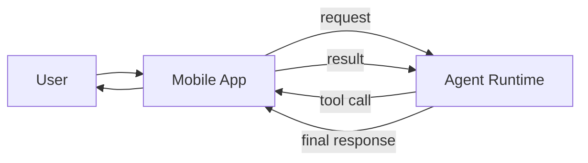
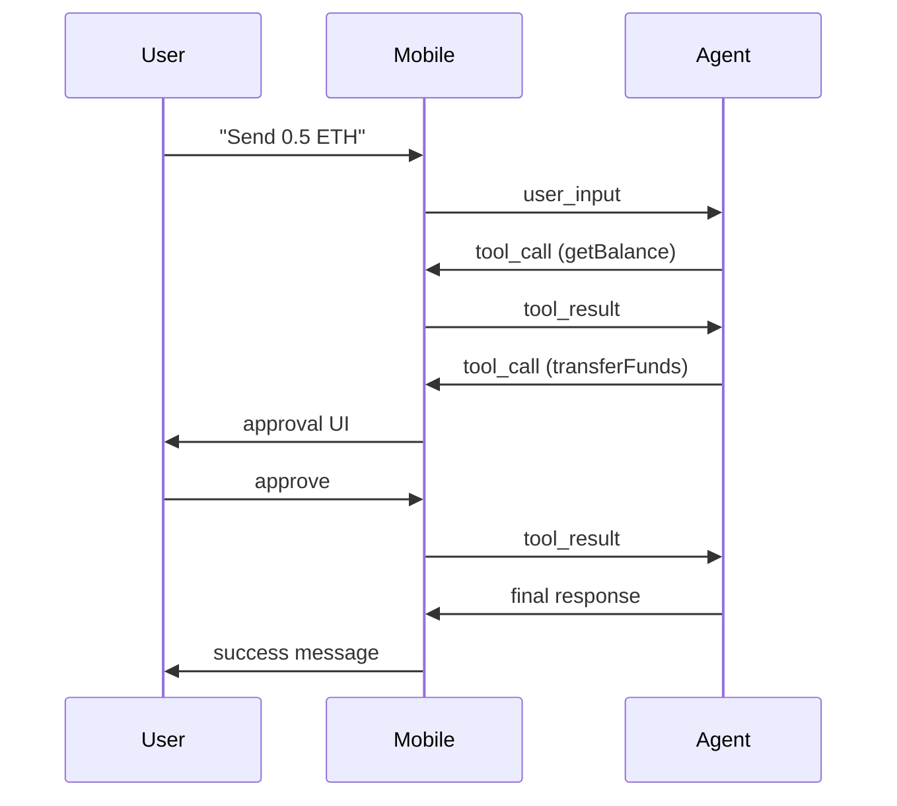

# 🧠 Takumi Wallet Agent Architecture (Mobile + Server)

## Overview

Takumi Agent is a **distributed agent system**:

- 📱 Mobile = **Execution Layer (hands)**
- 🧠 Server = **Agent Runtime (brain)**
- 🔐 User = **Final authority (approval layer)**

---

## 🏗️ High-Level Architecture



---

## ⚙️ Core Concepts

### 1. Agent Loop (Server-side)

```ts
type AgentState = {
  messages: Message[]
  context: any
  steps: number
}

async function runAgent(input: string): Promise<Output> {
  let state = initState(input)

  for (let i = 0; i < MAX_STEPS; i++) {
    const response = await llm(state)

    if (response.tool_call) {
      return {
        type: "tool_call",
        payload: response.tool_call
      }
    }

    return {
      type: "final",
      output: response.output
    }
  }
}
```

---

### 2. Tool Execution (Mobile-side)

```ts
type ToolCall = {
  id: string
  name: string
  args: any
}

type ToolResult = {
  id: string
  result?: any
  error?: string
}

async function executeTool(call: ToolCall): Promise<ToolResult> {
  try {
    switch (call.name) {
      case "getBalance":
        return { id: call.id, result: await wallet.getBalance() }

      case "transferFunds":
        return { id: call.id, result: await wallet.transfer(call.args) }

      case "signTransaction":
        return { id: call.id, result: await wallet.sign(call.args) }

      default:
        throw new Error("Unknown tool")
    }
  } catch (err) {
    return { id: call.id, error: err.message }
  }
}
```

---

## 🔌 Communication Protocol

### Transport Options
- WebSocket (recommended for streaming UX)
- HTTP (simpler fallback)

---

### Request: User → Agent

```json
{
  "type": "user_input",
  "input": "Send 0.5 ETH to 0x123..."
}
```

---

### Response: Agent → Mobile (Tool Call)

```json
{
  "type": "tool_call",
  "tool": {
    "id": "call_1",
    "name": "transferFunds",
    "args": {
      "amount": "0.5",
      "token": "ETH",
      "to": "0x123..."
    }
  }
}
```

---

### Response: Mobile → Agent (Tool Result)

```json
{
  "type": "tool_result",
  "tool": {
    "id": "call_1",
    "result": {
      "txHash": "0xabc..."
    }
  }
}
```

---

### Final Response

```json
{
  "type": "final",
  "output": "Transfer successful. Tx hash: 0xabc..."
}
```

---

## 🛡️ Permission System (CRITICAL)

### Action Tiers

| Tier | Action | Behavior |
|------|--------|----------|
| 1 | Read-only (balance, prices) | Auto |
| 2 | Simulation (gas, preview) | Soft confirm |
| 3 | State-changing (transfer, sign) | Hard confirm |

---

### Approval Flow (Mobile)

```ts
async function handleToolCall(call: ToolCall) {
  if (isSensitive(call)) {
    const approved = await showApprovalUI(call)

    if (!approved) {
      return {
        id: call.id,
        error: "User rejected"
      }
    }
  }

  return await executeTool(call)
}
```

---

## 🧠 Tool Schema (LLM-facing)

```json
[
  {
    "name": "getBalance",
    "description": "Get wallet balance",
    "parameters": {
      "type": "object",
      "properties": {
        "token": { "type": "string" }
      }
    }
  },
  {
    "name": "transferFunds",
    "description": "Transfer tokens",
    "parameters": {
      "type": "object",
      "required": ["amount", "to", "token"],
      "properties": {
        "amount": { "type": "string" },
        "token": { "type": "string" },
        "to": { "type": "string" }
      }
    }
  }
]
```

---

## 🔄 Full Interaction Flow



---

## 🧬 Agent Design Rules (AGENTS.md)

```md
# Takumi Agent Rules

## Objectives
- Help user manage crypto assets safely
- Never execute irreversible actions without approval

## Constraints
- Always verify balance before transfer
- Always simulate transaction before execution
- Never hallucinate wallet state

## Behavior
- Prefer smallest number of steps
- Recover from tool errors
- Ask clarification if ambiguous
```

---

## ⚡ UX Enhancements (Optional but Powerful)

### Streaming Status

```json
{
  "type": "status",
  "message": "Checking balance..."
}
```

---

### Optimistic UI
- Show pending transaction immediately
- Update after confirmation

---

### Retry Logic

```ts
if (toolResult.error) {
  retryWithFix()
}
```

---

## 🔐 Security Considerations

- Never expose private keys to agent runtime
- All signing MUST happen on device
- Validate all tool inputs
- Rate limit sensitive actions

---

## 🚀 Future Extensions

- Multi-agent roles (Trader, Risk Manager, Analyst)
- Strategy execution (DCA, arbitrage)
- On-chain monitoring triggers

---

## 🧭 Key Principle

> “Mobile executes. Server thinks. User decides.”
